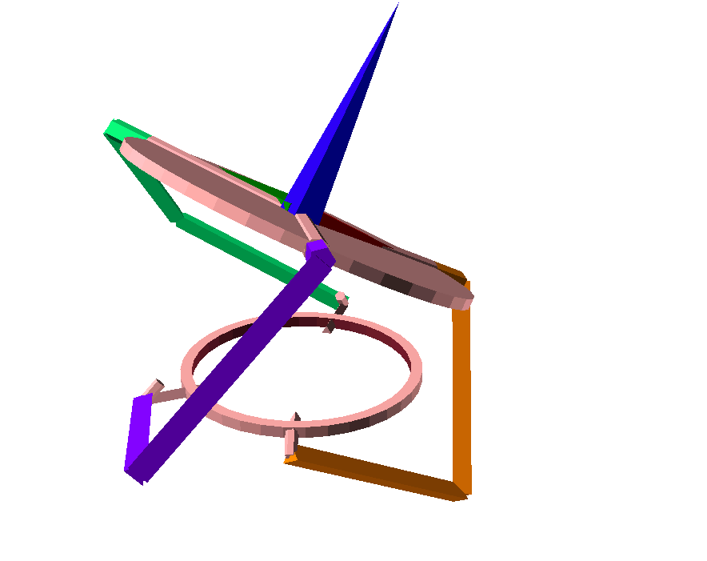

# Spherical mechanism inverse kinematics

This is the IK solution for spherical mechanism, providing proper orientation of the platform.

## Building

Use OpenSCAD.

## Animation

The model relies on the `$t` variable, which can be updated during animation.
